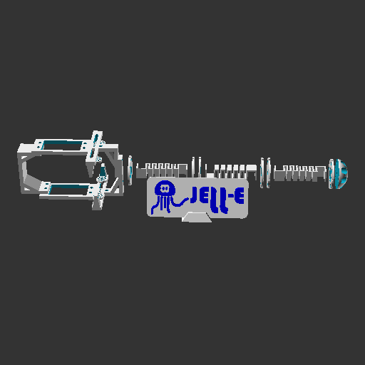
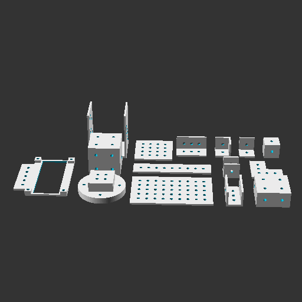
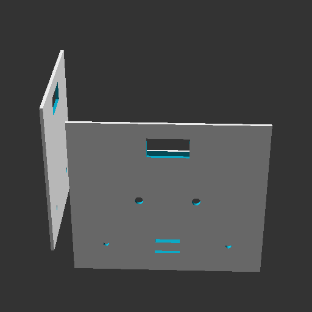
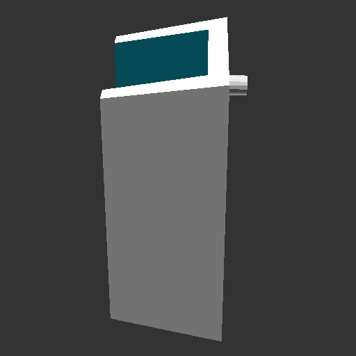
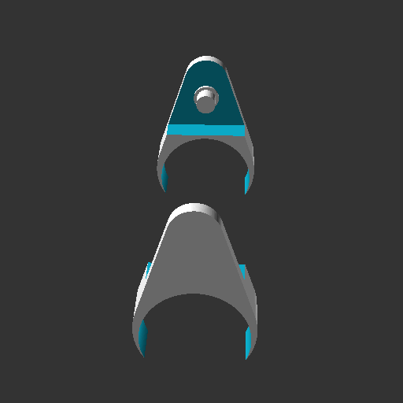

# OpenSCAD designs

This repository is a collection of some of the designs I created with [OpenSCAD](https://openscad.org).

## General details

For each one of the projects you will find the *.scad* source file(s), the *.stl* 3d model(s),
and a *.gif* image to quickly visualize the result.

A *Makefile* is also included, which - assuming to work on *project/scad/object.scad* - can be used as follows:
- `make project/scad/object.png` -> create a PNG of the object
- `make project/scad/object.gif` -> create a GIF of the object
- `make project/scad/object.stl` -> create the STL of the object

## Projects

Here is a list of the projects:
- [Flexible tentacle](#flexible-tentacle)
- [Holed parts](#holed-parts)
- [Servos case](#servos-case)
- [Signal generator foot](#signal-generator-foot)

### Flexible tentacle

This model is a modular, fully 3d-printable, flexible tentacle that can be controlled through two servomotors.

For convenience, the tentacle is split into multiple parts so that it can be extended as much as desired by
simply adding new sections. Just be sure to give an opposite orientation to two consecutive springs, which are
used to provide flexibility to a fully-PLA structure.

Two servomotors are able to move the tentacle horizontally and vertically at the same time, thanks to a
system of nylon wires and adjustable pulleys. Their housing can be seen at the beginning of the tentacle.

The overall design has been developed with a focus on compactness and lightness, since the final goal of the 
project was to develop a wearable robot.

You can take a closer look at the [SCAD sources](./flexible_tentacle/scad/) and the [STL models](./flexible_tentacle/stl/).

### Holed parts

These models are a variety of small and simple building blocks to create more complex designs.

They basically include planes and various kinds of joints, and everything is well-parametrized so that they can
be created with the desired size. All the parts have holes since they are meant to be mounted together through M3 bolts.

Lastly, there are also some models that allow mounting lcd displays, motors, and wheels. This is because the project
has been created with the goal of having a simple library to prototype the chassis for a modular mobile robot.

You can take a closer look at the [SCAD sources](./holed_parts/scad/) and the [STL models](./holed_parts/stl/).

### Servos case

This model is a case designed to quickly prototype with two servomotors moving along two different axes.

In the base there is space for two breadboards and a slot for a usb cable connected to an ESP32.
In the vertical plates there are two slots for the servomotors and two holes for leds, useful to provide
information about the current operating status. Everything is kept together through four M3 bolts in the base.

The project is intended to just simplify the placement of the electronic components, while cables and jumpers
are organized in a tidy way inside the enclosure.

You can take a closer look at the [SCAD sources](./servos_case/scad/) and the [STL models](./servos_case/stl/).

### Signal generator foot

This model is the accurate replica of a small part that broke and couldn't be find on sale.

In particular, it is one of the two feet of a signal generator. Without it the instrument couldn't properly stand upright.
There's nothing particular to point out, I just took some measurements of the broken part and modeled a new one. Easy fix.

You can take a closer look at the [SCAD sources](./signal_generator_foot/scad/) and the [STL models](./signal_generator_foot/stl/).

### Spool holder

This model is an upgrade I created for my 3d printer to improve the sliding on the filament spool.

In fact, as the filament is pulled by the extruder, the spool slowly starts rotating to unroll itself.
While this is not a problem per se because everything works as expected, the sliding of the spool is not optimal and
it unrolls in jerky movements. The resulting noise is also quite annoying (ok, maybe it is negligible compared with the
fan noise, but still).

So I came up with this part that can be mounted on the already exixting structure of the 3d printer.
It is thought to be integrated with a small ball bearing thanks to a snap-fit system, which allows the filament spool
to unroll itsel very smoothly and in a silent way.

You can take a closer look at the [SCAD sources](./spool_holder/scad/) and the [STL models](./spool_holder/stl/).

